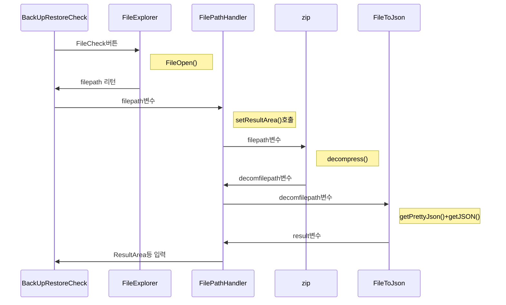
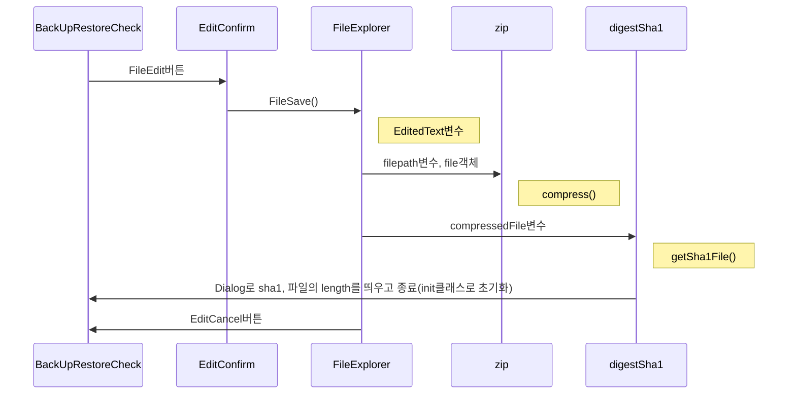

## BURC
 압축 파일을 불러와 해제한 후에 내부에 파일의 JSON형식의 글을 읽어서 JTextArea에 뿌린 후, 수정하여 다시 압축 저장하는 자바 프로그램

## Classes

 - BackUpRestoreCheck.java
 - DigestSha1.java
 - EditConfirm.java
 - FileExplorer.java
 - FilePathHandler.java
 - FileToJson.java
 - init.java
 - JSONUtils.java
 - zip.java

## BackUpRestoreCheck
**main**클래스를 포함하고 있으며, 가장 기본 프레임을 나타내주는 역할을 하고 있다.
 - **ResultArea** - 불러온 파일의 내용을 나타내주고 수정 할수 있게 해주는 JTextArea
 - **labelForText** - 불러온 파일의 경로를 나타내주는 JLabel
 - **OriginalJSON** - 수정 전의 파일의 내용을 저장해놓는 String, **'원래대로 되돌리기'** 버튼을 클릭 시 수정 되기 전의 내용으로 돌아가기 위해 사용
## FilePathHandler
**BackUpRestoreCheck**에서 **FileCheck**버튼을 통해 호출되며 **FileExplorer**클래스의 **FileOpen()** 메소드를 통해  불러올 파일의 경로를 **FileToJson** 으로 파일을 읽어들이고 **BackUpRestoreCheck** 의 **ResultArea**, **labelForText**, **OriginalJSON**에 내용을 채우는 역할을 하고 있다.
 - **decomfilepath** - SetResultArea()를 통해 전달 받은 filepath로 압축을 해제한 파일의 경로가 저장되는 변수 

## EditConfirm
**BackUpRestoreCheck**의 **FileEdit**버튼을 통해 호출되며, 수정 전 내용과 수정 후 내용을 같이 나타내 비교할 수 있도록 **JDialog**를 띄우고 **수정** 버튼을 통해 변경된 내용을 저장할 수 있게 **FileExplorer**클래스의 **FileSave()** 메소드를 호출하는 역할을 한다.
## FileExplorer
**EditExplorer**의 **EditOk**(수정) 버튼과 **BackUpRestoreCheck** 의 **FileCheck**(파일확인)버튼을 통해 호출되며, **JFileChooser**를 통해 파일을 불러와 경로를 리턴하는 **FileOpen()** 메소드와 수정된 파일을 **zip** 클래스의 **compress** 를 호출하여 압축 저장하는 **FileSave()** 메소드가 있다.

 - **folderpath** - **FileOpen()** 메소드에서 불러온 파일의 경로를 저장할 변수

## FileToJson
**FilePathHandler** 에서 호출되며, 파일의 경로를 이용해 내용을 읽어와 **getJSON()** 메소드에서 내용에 **JSON**이 있는지 없는지 판단하고 **getPrettyJson()** 를 통해 보기 좋은 형태로 변환하여 리턴한다.

 - **filepath** - 읽어들일 파일의 경로를 저장하는 변수, **FileToJson**의 객체가 생성될때 입력받는다.
 - **JsonStart** - 읽어온 파일의 내용에서 {가 시작되는 인덱스, **JsonEnd**는 마지막으로 }가 나오는 인덱스
 - **JsonArrayStart** - 읽어온 파일의 내용에서 [가 시작되는 인덱스, **JsonArrayEnd**는 마지막으로 ]가 나오는 인덱스

## JSONUtils
**FileToJson**의 **getJSON()** 을 통해 호출되며, 입력 받은 **String**이 **JSON**인지 아닌지 판단하여 **boolean**을 리턴하는 **isJSONValid()** 메소드와 **JSON**인 내용과 아닌 내용을 분리해서 리턴하는 **getJSONResult()** 메소드가 있다. 

 - **FirstNonJson** - 읽어온 파일의 내용에서 **Json**의 앞쪽에 작성된 **Json**이 아닌 내용
 - **LastNonJson** - 읽어온 파일의 내용에서 **Json**의 뒤쪽에 작성된 **Json**이 아닌 내용

## zip
**FileExplorer**클래스와 **FilePathHandler**클래스에서 호출되며 불러온 파일을 압축해제 하는 **decompress()** 메소드와 수정된 파일을 압축 저장하는 **compress()** 메소드가 있다.
## init
파일을 수정, 압축 저장이 완료됬을때 호출되며, **ResultArea**, **labelForText**, **OriginalJSON**을 초기화한다.
## 파일 불러오기

## 파일 수정하기

<!--stackedit_data:
eyJoaXN0b3J5IjpbMTczMzg4OTY4MF19
-->